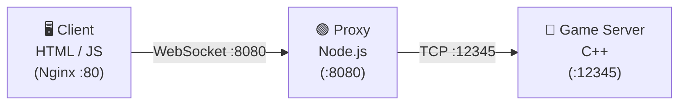
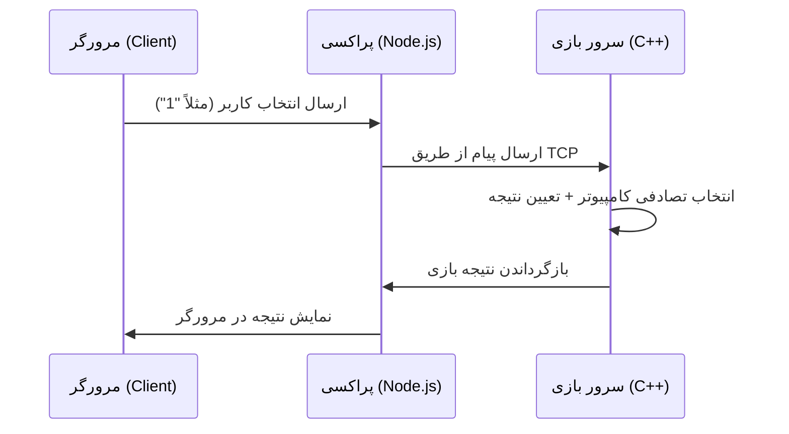

# 🎮 بازی سنگ، کاغذ، قیچی — Full Stack با C++ و Node.js و HTML/JS


---

## 📌 توضیحات پروژه

این پروژه یک بازی **سنگ، کاغذ، قیچی** آنلاین است که با معماری سه‌لایه طراحی شده است:

- **C++** برای سرور بازی (سوکت‌نویسی TCP)
- **Node.js** برای پراکسی (پل ارتباطی WebSocket ↔ TCP)
- **HTML/JavaScript** برای رابط کاربری وب
- **Docker Compose** برای اجرای یکپارچه و مجزای همه‌ی سرویس‌ها

کاربر از طریق مرورگر انتخاب خود (سنگ، کاغذ یا قیچی) را ارسال می‌کند، سرور C++ به‌صورت تصادفی انتخاب کامپیوتر را تولید می‌کند، نتیجه را محاسبه و به مرورگر برمی‌گرداند.

---

## 🏗️ معماری پروژه

### 🔹 نمای کلی ارتباط سرویس‌ها



### 🔹 جریان یک حرکت بازی



### 🔹 ساختار پوشه‌ها

```
project-root/
├── docker-compose.yml      # تعریف و اتصال هر سه سرویس
├── server/                 # سرور C++ (سوکت‌نویسی TCP)
│   ├── Dockerfile
│   └── main.cpp
├── proxy/                  # پراکسی Node.js (WebSocket Server)
│   ├── Dockerfile
│   ├── package.json
│   └── server.js
└── client/                 # کلاینت فرانت‌اند (HTML/JavaScript)
    ├── Dockerfile          # بر پایه nginx:alpine
    ├── index.html
    └── app.js
```

### 🔹 نقش هر بخش

| بخش | فایل اصلی | نقش |
|-----|-----------|-----|
| 🔵 سرور بازی | `server/main.cpp` | پردازش انتخاب‌ها، تولید انتخاب تصادفی کامپیوتر، تعیین نتیجه — هر کلاینت در یک **ترد مجزا** مدیریت می‌شود |
| 🟢 پراکسی | `proxy/server.js` | پل ارتباطی بین کلاینت‌های وب (WebSocket) و سرور C++ (TCP) — برای هر پیام یک اتصال TCP جدید برقرار می‌کند |
| 🟡 کلاینت | `client/index.html` و `client/app.js` | رابط کاربری تعاملی با دکمه‌های بازی و نمایش نتایج |

---

## ⚙️ پیش‌نیازها

| ابزار | استفاده |
|-------|---------|
| [Docker](https://docs.docker.com/get-docker/) + Docker Compose | اجرای کامل پروژه (روش پیشنهادی) |
| g++ (بیلد-اسنشال) | فقط برای اجرای دستی سرور C++ |
| Node.js 16+ | فقط برای اجرای دستی پراکسی |

> 💡 سرور C++ از سوکت‌های POSIX استفاده می‌کند؛ بنابراین اجرای دستی آن فقط روی **Linux** یا **WSL** (در ویندوز) امکان‌پذیر است. روش Docker روی همه‌ی سیستم‌عامل‌ها کار می‌کند.

---

## 🚀 راه‌اندازی و اجرا

### 🔹 روش ۱: اجرا با Docker Compose (پیشنهادی)

**۱. کلون کردن مخزن:**

```bash
git clone https://github.com/movtigroup/cpp-nodejs-html.git
cd cpp-nodejs-html
```

**۲. ساخت و اجرای همه‌ی سرویس‌ها:**

```bash
docker-compose up --build
```

**۳. شروع بازی:**

مرورگر را باز کنید و به آدرس زیر بروید:

```
http://localhost
```

از طریق دکمه‌های **سنگ**، **کاغذ** و **قیچی** بازی کنید؛ نتیجه‌ی هر دست در کادر خروجی نمایش داده می‌شود.

**۴. توقف سرویس‌ها:**

```bash
docker-compose down
```

### 🔹 روش ۲: اجرای دستی (بدون Docker)

```bash
# ۱) کامپایل و اجرای سرور C++ (روی Linux/WSL)
g++ -std=c++11 -pthread server/main.cpp -o server
./server

# ۲) اجرای پراکسی Node.js
cd proxy
npm install
npm start

# ۳) باز کردن client/index.html در مرورگر
```

> ⚠️ در اجرای دستی، مقدار `SERVER_HOST` در `proxy/server.js` روی `"server"` هاردکد شده است؛ برای اجرای محلی آن را به `"localhost"` تغییر دهید.

---

## 🔌 پورت‌های استفاده‌شده

| سرویس | کانتینر | پورت | پروتکل |
|-------|---------|------|--------|
| 🟡 کلاینت (Nginx) | `rps_client` | `80` | HTTP |
| 🟢 پراکسی | `rps_proxy` | `8080` | WebSocket |
| 🔵 سرور بازی | `rps_server` | `12345` | TCP |

همه‌ی سرویس‌ها در شبکه‌ی داخلی `rps-network` با درایور `bridge` به هم متصل هستند.

---

## 📡 پروتکل ارتباطی

کلاینت یک پیام متنی ساده ارسال می‌کند و سرور نتیجه را به‌صورت متن برمی‌گرداند:

### 🔹 پیام‌های ارسالی (کلاینت → سرور)

| پیام | معنی |
|------|------|
| `1` | سنگ 🪨 |
| `2` | کاغذ 📄 |
| `3` | قیچی ✂️ |
| `quit` | خروج و بستن اتصال |

### 🔹 قوانین بازی

- سنگ بر **قیچی**، کاغذ بر **سنگ** و قیچی بر **کاغذ** پیروز است.
- انتخاب یکسان → **مساوی**.
- ورودی نامعتبر → پیام خطا و ادامه‌ی بازی.

### 🔹 نمونه پاسخ سرور

```
شما: سنگ | کامپیوتر: قیچی | نتیجه: برد
```

---

## 🛠️ رفع اشکال (Troubleshooting)

| مشکل | راه‌حل |
|------|--------|
| خطای اشغال بودن پورت (مثلاً 80) | نگاشت پورت‌ها را در `docker-compose.yml` تغییر دهید، مثلاً `"8081:80"` |
| اتصال WebSocket برقرار نمی‌شود | مطمئن شوید سرویس `proxy` بالا آمده و پورت `8080` در دسترس است |
| تغییر نام سرویس `server` در Compose | مقدار `SERVER_HOST` در `proxy/server.js` را نیز هماهنگ کنید (این مقدار هاردکد شده است) |
| خطای کامپایل C++ در ویندوز | از WSL استفاده کنید یا پروژه را فقط با Docker اجرا کنید |

---

## 🛠️ توسعه بیشتر

### 🔹 ویژگی‌های قابل افزودن

✔️ **ذخیره نتایج بازی** در پایگاه داده (امتیاز و تاریخچه‌ی هر بازیکن)
✔️ **ارتباط امن** با استفاده از SSL/TLS (WSS و رمزنگاری TCP)
✔️ **گرافیک بهتر** در نسخه‌ی فرانت‌اند (انیمیشن و طرح‌بندی واکنش‌گرا)
✔️ **حالت چند نفره‌ی واقعی** برای رقابت آنلاین دو بازیکن
✔️ **پشتیبانی از متغیرهای محیطی** در پراکسی به‌جای مقادیر هاردکد
✔️ **خاموشی تمیز سرور** و مدیریت سیگنال‌ها در سرور C++

---

## 🤝 مشارکت

برای مشارکت در پروژه:

۱. مخزن را **Fork** کنید
۲. یک شاخه‌ی جدید بسازید (`git checkout -b feature/my-feature`)
۳. تغییرات را کامیت کنید (`git commit -m "Add my feature"`)
۴. یک **Pull Request** ارسال کنید

---

## 📄 لایسنس

این پروژه تحت **MIT License** منتشر شده و برای استفاده و توسعه آزاد است.

🔗 **توسعه‌دهنده:** movtigroup
✉️ **ارتباط:** [GitHub Repository](https://github.com/movtigroup/cpp-nodejs-html)
